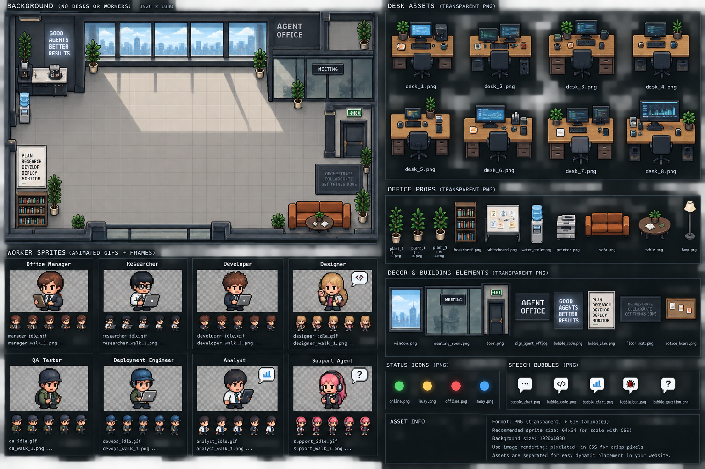

# Agent Office

Agent Office is a local web dashboard for coordinating an AI office manager and remote agent workers. It combines chat, task orchestration, worker monitoring, shared deliverables, durable memory, scheduled operations, tools, skills, and MCP configuration in one interface.



## Features

- Chat with an office manager backed by OpenAI, Ollama, or a custom OpenAI-compatible API.
- Register remote workers over WebSockets and route tasks by capability.
- Build dependency-aware task queues with progress checks, cancellation, and automatic review.
- Inspect worker activity, task history, shared files, and durable office memory.
- Configure provider credentials, model settings, tool permissions, system prompts, skills, and MCP servers from the UI.
- Schedule recurring operations and retain their results.

## Requirements

- Node.js 22.13 or newer (the server uses the built-in `node:sqlite` module).
- An API key for OpenAI or a compatible provider, unless you use a local Ollama server.

The project has no third-party runtime dependencies, so an install step is not required.

## Quick start

1. Copy the example configuration:

   ```sh
   cp .env.example .env
   ```

2. Edit `.env` and set at least:

   ```dotenv
   AI_HARNESS_WORKSPACE=/absolute/path/to/agent-office/.workspace
   AI_PROVIDER=openai
   AI_MODEL=gpt-5.1-codex
   AI_API_KEY=your-api-key
   ```

   For Ollama, use `AI_PROVIDER=ollama`, set `AI_MODEL`, and point `AI_BASE_URL` at your Ollama server. No API key is required.

3. Start the server:

   ```sh
   npm start
   ```

4. Open the URL printed in the terminal. With the example configuration, it is [http://127.0.0.1:8005](http://127.0.0.1:8005).

Provider settings can also be saved later under **Settings → Provider**. Values in `.env` seed or override the active configuration when the server starts.

## Configuration

See [`.env.example`](.env.example) for every supported option. The most useful settings are:

| Variable | Purpose | Default |
| --- | --- | --- |
| `HOST` | HTTP and WebSocket bind address | `127.0.0.1` |
| `PORT` | Server port | `8010` when unset |
| `AI_HARNESS_WORKSPACE` | Workspace the office manager may access | `.workspace` under the current directory |
| `AI_HARNESS_DATA_DIR` | Root for the SQLite database and runtime state | Current directory |
| `AI_HARNESS_SHARED_WORKSPACE` | Storage for worker-delivered artifacts | `deliverables` inside the office workspace |
| `AI_PROVIDER` | `openai`, `ollama`, or `custom` | `openai` |
| `AI_MODEL` | Model used by the office manager | Provider default |
| `AI_BASE_URL` | Provider API endpoint | Provider default |
| `AI_API_KEY` | Provider credential | Empty |
| `AI_HARNESS_WORKER_TOKEN` | Shared credential used for worker registration | Not set |
| `AI_HARNESS_TASK_PROGRESS_CHECK_INTERVAL_MS` | Interval for checking long-running tasks | `300000` (5 minutes) |
| `AI_HARNESS_ALLOW_INSECURE_WEBSOCKET` | Force the dashboard connection to use `ws://`, including from an HTTPS page | `false` |

Tool access and workflow stages can be enabled or disabled with the `AI_HARNESS_TOOL_*` and `AI_HARNESS_WORKFLOW_*` variables shown in `.env.example`.

`AI_HARNESS_ALLOW_INSECURE_WEBSOCKET=true` is intended for trusted development environments and browser shells that permit mixed content. Standard browsers generally block `ws://` from an HTTPS page; for those deployments, configure the HTTPS reverse proxy to forward WebSocket upgrades and keep using `wss://`.

Runtime data is stored in `db/ui-state.sqlite` by default. Office Manager files and worker deliverables are isolated under `.workspace/`. Set `AI_HARNESS_DATA_DIR` if you want to keep the SQLite database outside the source checkout.

## Connecting workers

Workers connect to:

```text
ws://HOST:PORT/ws/workers
```

On **Dashboard → Live Worker Registry**, generate a token, copy the one-time value, and use it in the worker's registration message or as a bearer token. You can alternatively seed the first token with `AI_HARNESS_WORKER_TOKEN` in `.env`.

The complete registration, task, progress, cancellation, artifact, and reconnection protocol is documented in [Agent Worker Integration Specification](doc/sub-agent-spec.md). See [Sequential task orchestration](doc/task-orchestration.md) for dependency and review behavior, and [Worker WebSocket API](doc/worker-websocket-api.md) for the transport-level API reference.

## Development

Run the full test suite:

```sh
npm test
```

The browser application is served directly from `public/`; the HTTP/API server starts from `server.js`. There is no build step.

## Security

Agent Office can grant models file, shell, network, browser, and MCP access. Keep it bound to localhost unless you have placed it behind appropriate network access controls, enable only the tools you intend to expose, and use `wss://` for workers connecting over an untrusted network. The worker token authenticates worker registration; it does not protect the web dashboard or HTTP API.

## License

ISC
